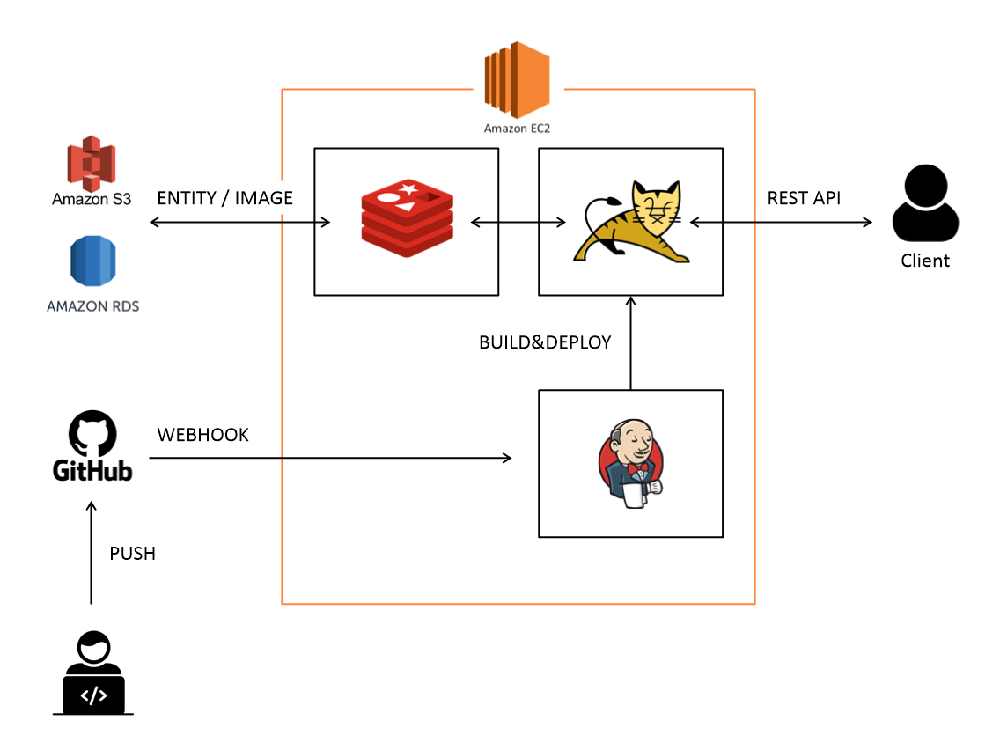

# joonggo-market-service

### 개발동기

- 중거 거래 서비스의 기능들을 직접 구현하여 백엔드 시스템에 대한 이해도를 높이고 싶었다.
- 중고 거래 플랫폼 [번개장터](https://m.bunjang.co.kr/)를 참고했다.

### 사용기술

- Spring 5
- JDK 1.8
- MySQL
- AWS

### [유스케이스](https://github.com/chan-gon/joonggo-market-service/wiki/Use-Case)

### [ERD](https://github.com/chan-gon/joonggo-market-service/wiki/ERD)

### [Service Architecture](https://github.com/chan-gon/joonggo-market-service/wiki/Service-Architecture)

### [Study&Refactoring](https://github.com/chan-gon/joonggo-market-service/wiki/Refactoring)

### [커밋 메시지 규칙](https://github.com/chan-gon/joonggo-market-service/wiki/Git-%EC%BB%A4%EB%B0%8B-%EB%A9%94%EC%8B%9C%EC%A7%80-%EA%B7%9C%EC%B9%99)