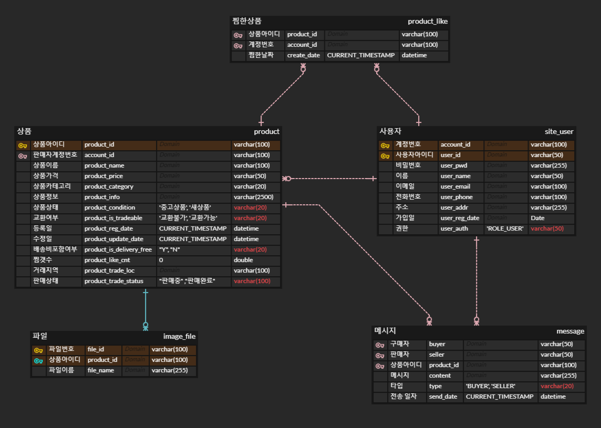

# joonggo-market-service

### 개발동기

- 중고 거래 서비스의 기능을 직접 구현하여 백엔드 시스템에 대한 이해도를 높이고 싶었습니다.

### 사용 기술 - 구현
- Spring 5
- Maven 3.5.2
- JDK 1.8
- MySQL 8.0.27
- Redis 2.1.3

### 사용 기술 - 배포
- AWS(EC2/RDS/S3)
- Jenkins
- GitHub

### 주요 기능

- 회원 가입
- 상품 등록
- 상품 검색(카테고리별&상품 이름)
- 상품 찜하기
- 사용자간 메시지 교환

### 프로젝트 전체 구조

- 자세한 내용을 [Wiki](https://github.com/chan-gon/joonggo-market-service/wiki/Service-Architecture)에서 확인할 수 있습니다.


### 프로젝트의 주요 관심사

<details>
<summary>접기/펼치기</summary>

##### 공통사항

- **설계>구현>배포**까지의 모든 단계를 컨트롤 해서 혼자서 하나의 서비스를 출시할 수 있는 능력 함양.


- 코드 한 줄, 메소드 하나, 적용되는 기술 하나에도 타당한 이유를 가지고 사용할 수 있는 능력 함양.


- Unit test를 원활하게 수행할 수 있는 **테스트 가능한 코드(지속 가능한 코드)**를 작성할 수 있는 능력 함양.

##### 코드 컨벤션

- [Google code Style](https://google.github.io/styleguide/javaguide.html)을 준수

##### 성능 최적화

 - 서버 부하를 줄이기 위해 캐싱 서버 활용
 
##### 브랜치 관리

Git Flow를 사용하여 브랜치 관리.  

이 프로젝트에서는 Master, Develop, Feature, Release 브랜치를 사용했습니다.


- Master: 배포에 사용

- Develop: 개발이 완료된 Feature가 Merge되는 장소 

- Feature: 기능 개발을 진행할 때 사용

- Release: 배포를 준비할 때 사용

- Hot-Fix: 배포를 진행한 후 발생한 버그를 수정해야 할 때 사용

##### 테스트

- JUnit4를 활용한 테스트 코드 작성


- Jennkins CI를 적용하여 배포 전 자동으로 테스트 하도록 설정

##### 성능 테스트

- NGrinder로 성능 테스트를 하고 있습니다.

</details>

### 폴더 구조

<details>
<summary>접기/펼치기</summary>

```
|   +---java
|   |   \---com
|   |       \---board
|   |           +---controller
|   |           |   |   HomeController.java
|   |           |   |   MessageController.java
|   |           |   |   ProductController.java
|   |           |   |   UserController.java
|   |           |   |
|   |           |   \---.mvn
|   |           |       \---wrapper
|   |           +---domain
|   |           |       Criteria.java
|   |           |       ImageVO.java
|   |           |       MessageVO.java
|   |           |       PageDTO.java
|   |           |       ProductLikeVO.java
|   |           |       ProductVO.java
|   |           |       UserVO.java
|   |           |
|   |           +---exception
|   |           |   +---common
|   |           |   |       CommonExceptionHandler.java
|   |           |   |
|   |           |   +---file
|   |           |   |       ImageUploadFailException.java
|   |           |   |       TextFileException.java
|   |           |   |
|   |           |   +---product
|   |           |   |       ProductException.java
|   |           |   |       ProductExceptionHandler.java
|   |           |   |       ProductExceptionMessage.java
|   |           |   |       ProductNotFoundException.java
|   |           |   |
|   |           |   \---user
|   |           |           UserException.java
|   |           |           UserExceptionHandler.java
|   |           |           UserExceptionMessage.java
|   |           |           UserExistsException.java
|   |           |           UserNotFoundException.java
|   |           |
|   |           +---mapper
|   |           |       ImageMapper.java
|   |           |       MessageMapper.java
|   |           |       ProductLikeMapper.java
|   |           |       ProductMapper.java
|   |           |       UserMapper.java
|   |           |
|   |           +---redis
|   |           |       RedisConfig.java
|   |           |
|   |           +---security
|   |           |       CustomAccessDeniedHandler.java
|   |           |       CustomAuthenticationProvider.java
|   |           |       CustomLoginFailureHandler.java
|   |           |       CustomLoginSuccessHandler.java
|   |           |       CustomUserDetailsService.java
|   |           |
|   |           +---service
|   |           |       ImageService.java
|   |           |       ImageServiceImpl.java
|   |           |       MessageService.java
|   |           |       MessageServiceImpl.java
|   |           |       ProductLikeService.java
|   |           |       ProductLikeServiceImpl.java
|   |           |       ProductService.java
|   |           |       ProductServiceImpl.java
|   |           |       UserService.java
|   |           |       UserServiceImpl.java
|   |           |
|   |           \---util
|   |                   EmailUtils.java
|   |                   ImageFileUtils.java
|   |                   LoginUserUtils.java
|   |                   MessageUtils.java
|   |                   PasswordEncryptor.java
|   |
|   +---lombok
|   |       lombok.config
|   |
|   +---resources
|   |   |   log4j.xml
|   |   |   log4jdbc.log4j2.properties
|   |   |
|   |   +---com
|   |   |   \---board
|   |   |       \---mapper
|   |   |               ImageMapper.xml
|   |   |               MessageMapper.xml
|   |   |               ProductLikeMapper.xml
|   |   |               ProductMapper.xml
|   |   |               UserMapper.xml
|   |   |
|   |   \---META-INF
|   \---webapp
|       |
|       \---WEB-INF
|           |   web.xml
|           |
|           +---classes
|           +---message
|           |       email_en_US.properties
|           |       message-servlet.xml
|           |       security_en_US.properties
|           |
|           +---spring
|           |   |   root-context.xml
|           |   |   security-context.xml
|           |   |
|           |   \---appServlet
|           |           servlet-context.xml
|           |
|           \---views
|               +---error
|               |       403.jsp
|               |       404.jsp
|               |       500.jsp
|               |       exception.jsp
|               |
|               +---includes
|               |       footer.jsp
|               |       header.jsp
|               |       sidebar.jsp
|               |
|               +---login
|               |       idInquiry.jsp
|               |       pwdChange.jsp
|               |       pwdInquiry.jsp
|               |
|               +---message
|               |       list.jsp
|               |       receivedMsg.jsp
|               |       sentMsg.jsp
|               |
|               +---product
|               |       newProduct.jsp
|               |       productDetail.jsp
|               |       shop.jsp
|               |       update.jsp
|               |
|               \---users
|                       delete.jsp
|                       login.jsp
|                       main.jsp
|                       profile.jsp
|                       signup.jsp
|
\---test
    +---java
    |   \---com
    |       \---board
    |           +---controller
    |           |       MessageControllerTest.java
    |           |       ProductControllerTest.java
    |           |       UserControllerTest.java
    |           |
    |           +---mapper
    |           |       MessageMapperTest.java
    |           |       ProductMapperTest.java
    |           |       UserMapperTest.java
    |           |
    |           +---persistence
    |           |       DataSourceTests.java
    |           |       JDBCTests.java
    |           |
    |           +---service
    |           |       UserServiceTest.java
    |           |
    |           \---util
    |                   RedisCacheConfigTest.java
    |
    \---resources
        |   log4j.xml
        |
        \---org
            \---springframework
                \---restdocs
                    \---templates
                        \---asciidoctor
                                request-fields.snippet
                                request-parameters.snippet

```

</details>

### ERD

<details>
<summary>접기/펼치기</summary>



</details>

### 유스케이스 - [Click](https://github.com/chan-gon/joonggo-market-service/wiki/Use-Case)

### API Documents - [Click](https://chan-gon.github.io/portfolio/assets/projects/joonggo-market/api-doc.html)

### Study&Refactoring - [Click](https://github.com/chan-gon/joonggo-market-service/wiki/Study-&-Refactoring)

## 향후 추가할 기능

- 실시간 채팅 기능
- 상품 결제 기능
- SNS 계정을 통한 간편 로그인 기능
- 누군가 메시지를 보내면 notification이 발송되는 기능
- HTTPS SSL 인증서 적용
- 대량의 요청을 처리할 수 있는 환경 구축